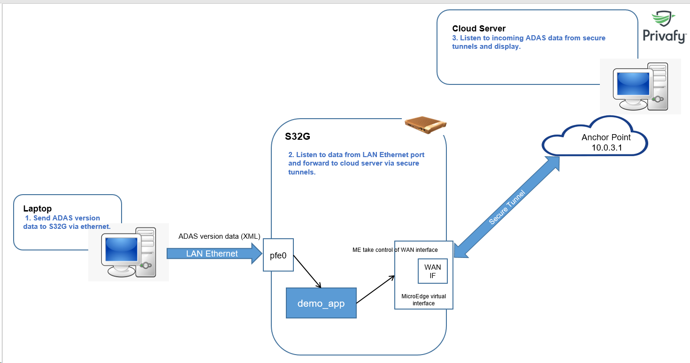
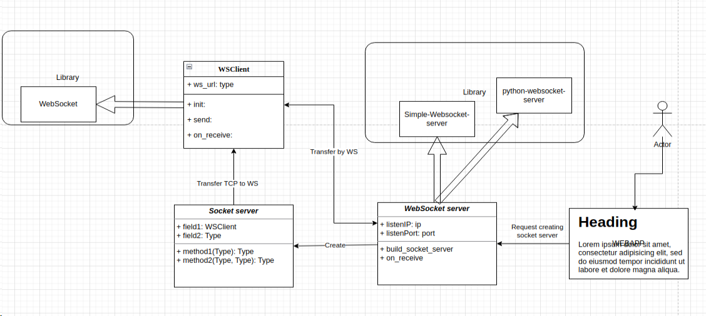

# ADAS Simulator and Cloud Simulator

## System overview


## Overview of ADAS Simulator and Cloud Simulator


## Requirements
- OS: Ubunbu 20.4

## Setup environment
```
- sudo apt install python3

- python3 -m venv venv

- source venv/bin/active
```
## Installation
```
- pip install -r requirements.txt
```

## Usage
### ADAS Simulator
- run command: ```python ./laptop_demo.py```
- Open link from web browser: http://localhost:8889/webdemo/laptop.html
- Input IP and port then clicking "Connect" to connect to the board. 

### Cloud Simulator
- run command: ```python ./cloud_demo.py```
- Open link from web browser: http://localhost:8888/webdemo/cloud.html
- Input port then clicking "Listen" to listen from the board. 

